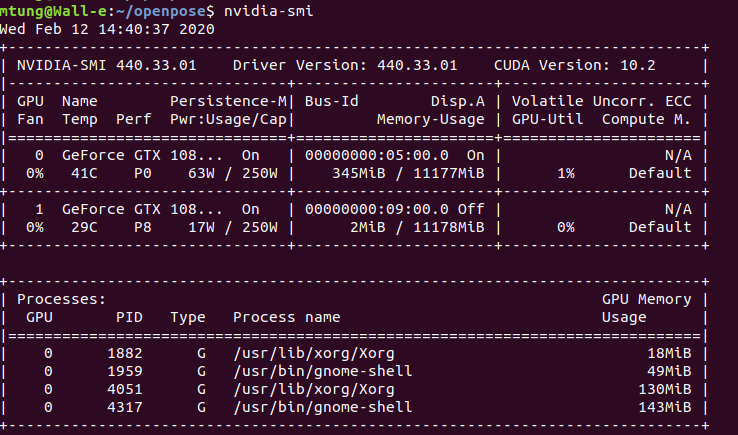

# body-pose-in-dyads

This is a pipeline that is supposed to take video of a child and parent reading together and be able to monitor and extract features based on their body features. The end game would able to have this work in realtime so that a robot may monitor them and assess and learn things such as child engagement and the like.

## Requirements
* (This has only been tested on Ubuntu 18.04 with a Nvidia GeForce GTX 1080 GPU)
* Python 3 
* OpenCV
* Face Modeling: [face_rec][1]
  * This is a library created by Sharifa, so you may need to ask her for access
  * Make sure to checkout the ```matt``` branch
* Interaction Analysis: [Interaction_analysis][2]
  * Also created by Sharifa, checkout ```matt``` branch
  * NOTE: This is mostly still only made for the Lifting From the Deep Library, openpose functionality is underway
* Body Pose extraction library:
  * [Lifting from the Deep][3]
    * This is what we were originally working with, but it has shown to fail a lot on our source video
    * For this to operate correctly, you should need of up to step ii of the GPU Requirements working 
    * Version used was last updated Nov. 5, 2019, commit [c919881][4]
  * [Openpose][5]
    * This is a very popular and reliable library, but does not get 3d pose.
    * You will need a GPU, CUDA, CUDnn, for this to run efficiently
    * Once you satisify the GPU requirement, follow the openpose instructions to config everything
    * Version used was last updated Jan 20, 2020, commit [d78ae77][6]
   
* Head Pose extraction library: 
  * This should be included in ```Interaction_analysis``` library
* Any other libraries or dependencies should be obtained when acquiring all of the above. We recommend using a Virtual Environment or Docker Container to keep it all together.

* GPU Requirements:
    * In order for a lot of this pipeline to work, you will be a properly set up GPU.
      1. Have a computer with a working GPU (we use a Nvidia GeForce GTX 1080)
      2. Have to a proper driver installed for your GPU, if its working correctly, you should run ```nvidia-smi``` get something like the image below. 
         * If this doesn't you will need to install the correct driver, in Ubuntu 18.04, you can just go to the ```Additional Drivers``` tab of ```Software & Updates``` and find the one that works with your GPU, we use 440. If you can't find one that works, you'll have to download it online.
      3. Install Cuda and CudNN
         * Currently we use Cuda version 10.2.89 and CudNN 7+
         * Run to ```nvcc --version``` to verify you have Cuda installed correctly
         * If you don't have it, you will have to install from the [Nvidia website][7]

     
   
## Components
There are currently 2 scripts that this library uses to work with all the libraries above.

### 1. **feature_config.py**
This file is a global config file that has/should contain all of the important variables that feature controller uses such as:
* File locations to grab and save files 
* What Body Pose extraction method to use (openpose, or Lifting from the Deep)
* Video Resolution
* Processing windows
* Num of Features to grab (deprecated until further notice)

* NOTE: Some of these variables are not being used anymore and just brought over from the libraries 

### 2. **feature_controller.py**
This is the main controller that uses all of the libraries mentioned above to model faces then get their positions and extract features from the parent-child videos for record or (TODO) robot action.

* *model_faces* This takes isolated video of the subjects faces and creates models for facial recognition
  * Calls ```save_face_images.py```, ```model_training.py```, and ```model_testing.py``` from ```face_rec``` directly.

* *get_positions* Reads source video and gets the head and body pose of the parent and child
  * Lifting from the Deep method calls ```myPose.py``` from ```Interaction_analysis``` for body pose 
  * Head pose calls ```find_3d_face.py``` from ```Interaction_analysis```
  * Openpose is called straight in here for now
  * It uses results from *model_faces* to assign bodies to parent and child
  * If set to be *continuous* in the ```feature_config.py```, it will carry out *extract_features* and *get_features* within itself.
 
* *extract_features* Takes Pose data (as numpy array) from *get_positions* and extracts features such as pitch, yaw, etc.
  * Lifting fomr the Deep method calls ```body_pose_analysis.py``` from ```Interaction_analysis``` to extract said features
  * Head calls ```head_pose_analysis.py``` from ```Interaction_analysis```

* *get features* Take feature data (as numpy array) from *extract_features* and save it into csv file
  * Calls ```body_pose_stats.py``` and ```head_pose_stats.py``` from ```Interaction_analysis``` 
  * TODO: Extend to robot behavior.
  
## FAQ
*Files aren't being made or can't find video/npy files??*

Check your directories and make sure they exist/are correct. The code will create most of the directories if it can't find the first level (ie. 3d_pose/), but it usually won't create anything much deeper. So either delete all of the directories and manually fill in the holes so that files can be grabbed from/saved to there

*Models/layers/other cool CV files aren't being found/invalid point??*

Make sure you have the model files for the libraries. Lifting from the Deep, Openpose, and face_rec have certain files that are needed to work, look at the source for the libraries as some of these files are quite large.

*Errors about GPU or how there is none??*

You will need a GPU to do this efficiently in the first place, make sure you have the right drivers and the GPU is being used
In Ubuntu you can call ```nvidia-smi``` (for Nvidia GPUs) and see if you have a connected GPU.


[1]: https://github.com/sghowinem/face_rec "Title"
[2]: https://github.com/sghowinem/Interaction_analysis "Title"
[3]: https://github.com/DenisTome/Lifting-from-the-Deep-release "Title"
[4]: https://github.com/DenisTome/Lifting-from-the-Deep-release/tree/c9198815778c5fbba9637b47ef92fc34a0dfed50 "Title"
[5]: https://github.com/CMU-Perceptual-Computing-Lab/openpose "Title"
[6]: https://github.com/CMU-Perceptual-Computing-Lab/openpose/tree/d78ae77fa660fdf75300a5ff1aebab0783052c7b "Title"
[7]: https://developer.nvidia.com/ "Title"
